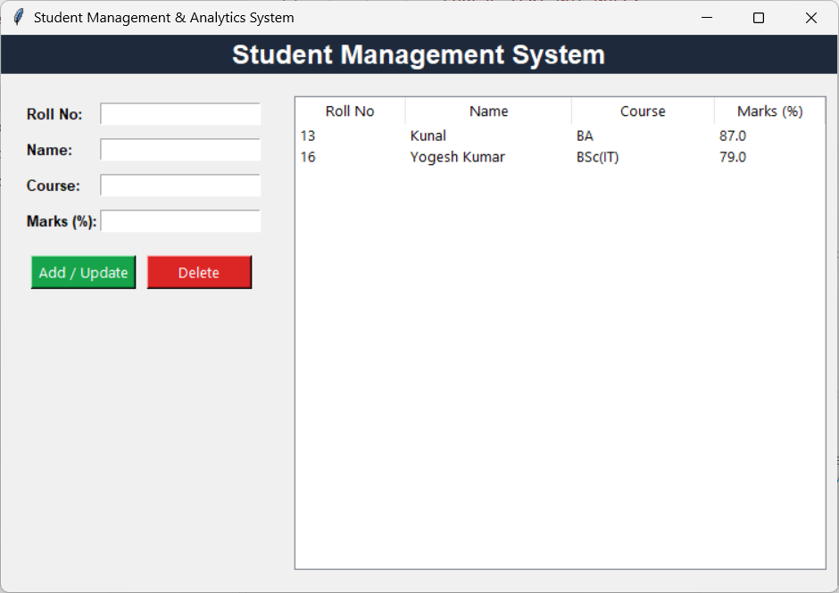

# 🎓 Advanced Student Management & Analytics System

A desktop-based CRUD application built using Python, Tkinter GUI, and SQLite Database. This application replaces traditional CLI tools with a modern UI and persistent relational database storage.

## ✨ Key Features
- **Modern Graphical User Interface (GUI):** Built with Tkinter for smooth user interaction.
- **SQLite Database Integration:** Full CRUD (Create, Read, Update, Delete) operations using SQL queries.
- **Real-time Table View:** Displays dynamically updated student records in a formatted data table.
- **Data Validation & Error Handling:** Auto-prompts for missing data and constraint checks.

## 🛠️ Tech Stack
- **Language:** Python 3.x
- **GUI Framework:** Tkinter
- **Database:** SQLite3
- **Version Control:** Git & GitHub

## 📸 Application Preview



## 🚀 How to Run
1. Clone the repository:
   ```bash
   git clone [https://github.com/8800yogesh/Student-Management-System.git]